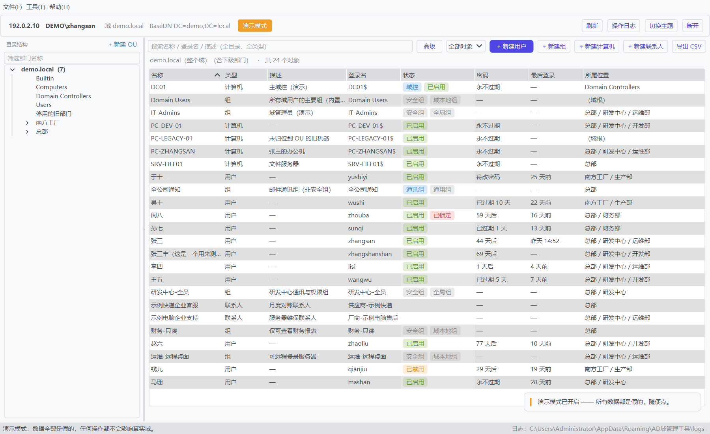
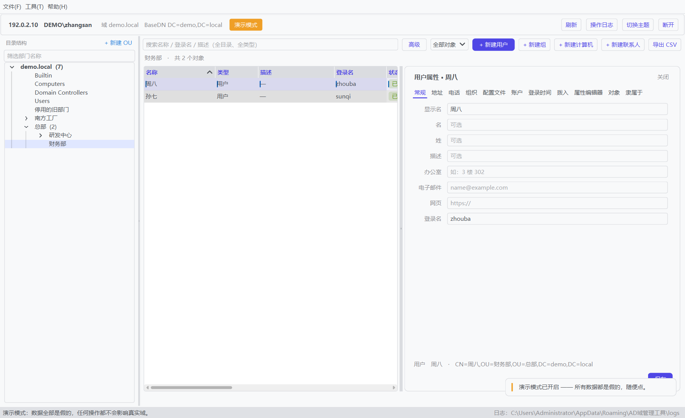
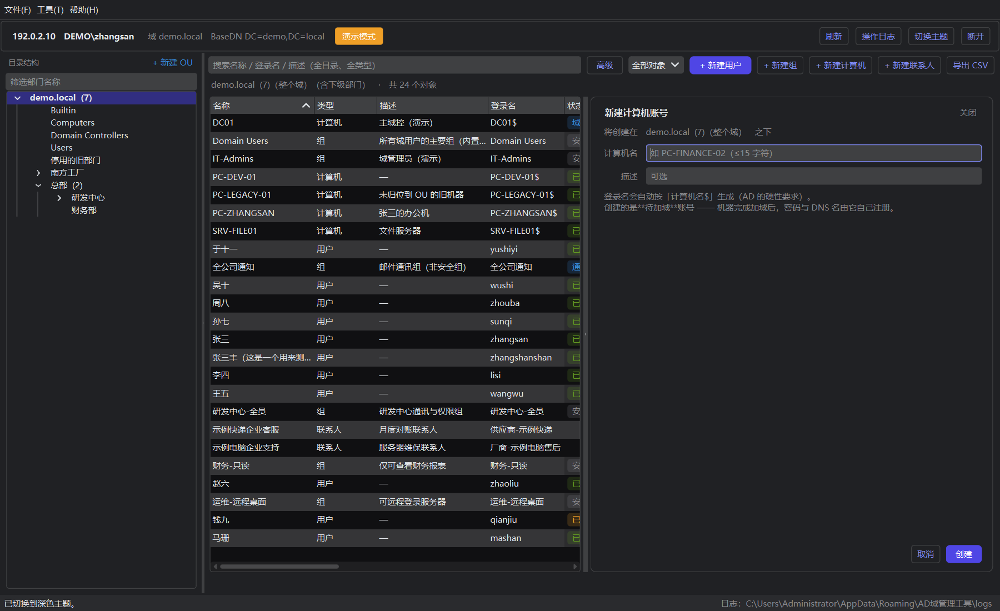
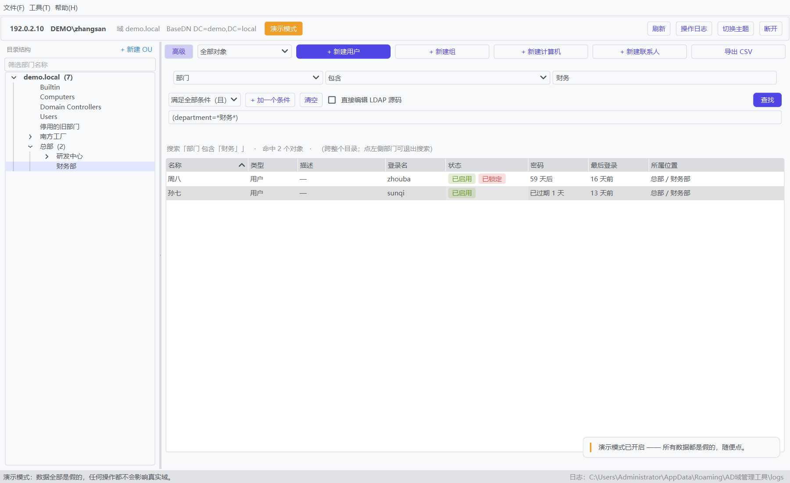
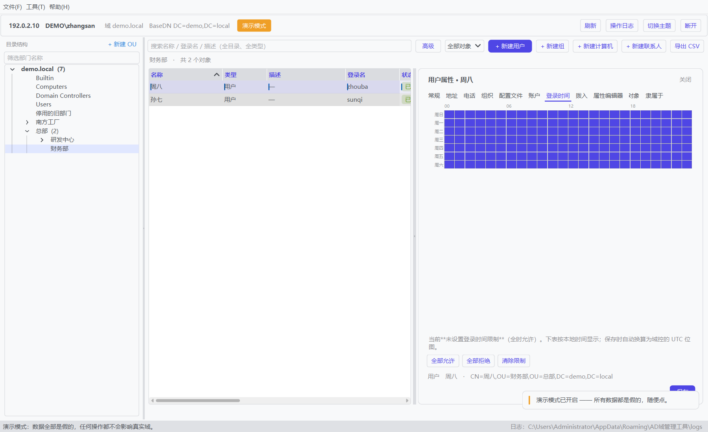

# 帮帮AD域管理工具

**在一台没有加入域的 Windows 机器上，管理 Active Directory。**

把 ADUC（`dsa.msc`）里最常用的那几件事 —— **解锁 · 启用/禁用 · 重置密码 · 新建用户/组/计算机/组织单位 · 属性编辑 · 组策略只读查看** —— 做成一个双击就跑的单机程序：不用装 RSAT，不用加域，不用碰域控。



`Python 3.13` · `PyQt6` · `ldap3` · `Windows 10 / 11 (x64)` · 版本 `1.0.0`

---

## 目录

- [30 秒跑起来](#30-秒跑起来)
- [能做什么](#能做什么)
- [界面](#界面)
- [为什么它能连上](#为什么它能连上)
- [安全与隐私](#安全与隐私)
- [常见问题](#常见问题)
- [源码结构](#源码结构)
- [自行打包](#自行打包)
- [许可](#许可)

---

## 30 秒跑起来

### 用现成的 exe

1. 下载 [`bbad-1.0.0-win64.zip`](https://github.com/foxtap/bbad/releases/download/v1.0.0/bbad-1.0.0-win64.zip)（约 40 MB；[Releases 页](https://github.com/foxtap/bbad/releases/tag/v1.0.0)），解压到任意目录；
2. 双击 **`bbad.exe`**；
3. 在「连接」页填**域控 IP**（填 IP 就行，不必是域名）、账号写 `域\用户`、口令，点连接。

> 配置与日志写在 `%APPDATA%\AD域管理工具\`，**不在 exe 同目录** —— 所以 exe 放哪都行，
> 换台机器自动就是一份全新的空配置。
>
> 没环境也能看：连接页勾上**演示模式**，会加载一个假的演示域（`demo.local` +
> 文档专用地址段），所有界面都能点，任何操作都不会碰到真实域。

### 从源码跑

```bat
python -m venv .venv
.venv\Scripts\pip install -r requirements.txt
packaging\run_dev.bat
```

源码直跑一个来回 1~2 秒，改界面时用这个；只想要功能就用上面的 exe。

---

## 能做什么

| 分类 | 能力 |
|---|---|
| **连接** | 域控 IP/端口（可选 LDAPS）· `域\用户` 身份 · 匿名读 RootDSE 反查域名与 BaseDN · 多套连接配置 · 口令可选「记住」（DPAPI 加密） |
| **浏览** | 组织单位树（带筛选框）· 对象列表（名称/类型/描述/登录名/状态/密码策略/最后登录/所属位置）· 全目录搜索 · 高级查找条件构建器 · 导出 CSV |
| **用户** | 新建 · 复制（可选 UPN 后缀）· 重命名 · 移动到 · 删除（**先算出会影响多少个对象**）· 启用/禁用 · 解锁 · 重置密码（单个 / 批量设同一新口令，改前有本地预检）· 设置默认密码 · 登录时间网格 · 拨入页 |
| **组** | 新建 · 查看成员 · 添加成员 · 重命名 · 移动到 · 删除 |
| **计算机** | 新建 · 启用/禁用 · 重置计算机账户 · 加入组 · 移动到 · 删除（**域控机禁止在此禁用/重置/删除**） |
| **组织单位** | 新建 · 重命名 · 移动到 · 递归删除（先预演影响范围，再确认） |
| **属性** | 常规 / 原始属性编辑器 / 对象 / 成员 / 隶属于 |
| **组策略** | **只读**：域内 GPO 列表 · 某个 OU 套了哪些 GPO（顺序、启用、强制）· 某个 GPO 链在哪些 OU · 设置摘要 · 安全筛选 |
| **运维** | 操作日志窗口（含**操作前 / 操作后**的值）· 强制复制同步 · 导出诊断包 · 打开配置与日志目录 · 深浅色切换 |

---

## 界面

|  |  |
|---|---|
|  |  |
| 属性面板：常规 / 原始属性编辑器 / 对象 / 成员 / 隶属于 | 深色主题（工具栏与菜单可切换） |
|  |  |
| 高级查找：条件构建器 | 登录时间网格 |

> 本仓库所有截图都出自**演示模式**，界面里的地址、域名、账号都是文档专用占位值。

---

## 为什么它能连上

`dsa.msc` 连域控前会做 DNS 校验。在**没有加入域**的机器上，它经常直接回一句
「指定的域不存在，或无法联系」—— 哪怕网络是通的、账号密码是对的。这是它最常见的劝退点。

本工具绕开这一步：

1. 用 `ldap3` + **NTLM** 直连 IP，身份写成 `域\用户`（不是 UPN）；
2. 连之前先**匿名读 RootDSE**，反查出真实域名与 `BaseDN`；

于是能不能管，只取决于一句话：**389 通、账号密码对**。

改密码走**双通道降级**：先 RPC（`WinNT://` + `LogonUser` 身份模拟，135/445），失败再走 LDAPS（`modify_password`，636）。
但**认证类与策略类错误不降级** —— 否则一次「密码不符合策略」会被糊成一句「所有通道都失败」，反而更难排查。

---

## 安全与隐私

| 项 | 做法 |
|---|---|
| 明文口令 | **不落盘**。只有主动勾「记住密码」时才用 Windows **DPAPI** 加密保存（作用域 = 本机 + 当前 Windows 账号，文件拷走也解不开） |
| 审计日志 | 所有修改类操作都记本地审计，含**操作前 / 操作后**的值，方便回溯 |
| 审计里的口令 | **永不出现**。改密只留「口令已重置」这一件事 |
| 配置位置 | `%APPDATA%\AD域管理工具\`，与 exe 分开（exe 常在 U 盘或共享盘上，写权限不稳） |
| 演示模式 | 内置假数据域，随便点都不影响真实域；本仓库截图全部出自它 |
| 本仓库内容 | **不含**任何真实域控地址、域名、账号或口令 |

---

## 常见问题

**Q：为什么不用 `dsa.msc`？**
因为它要求先加域、先装 RSAT。手边只有一台会员机、又要临时解锁一个账号时，它用不了。

**Q：新建完用户，文件服务器的「选择用户或组」里搜不到。**
这是 AD 的多主复制：写入点和读取点不是同一台时，要等复制过去才搜得到（同站点约 15 秒，跨站点默认 180 分钟）。
用 **工具 → 强制复制同步** 立刻把改动推给这台域控的复制伙伴，不必等周期。

**Q：强制复制同步报错说不支持。**
本工具常跑在**未加域**的机器上，而 `repadmin` 只吃域名、不吃 IP，本机也解析不了域控名 —— 这条路在那样的机器上本来就不通。
所以它**默认不自动推**，需要时手工点一次；点了失败也不影响已经改好的对象。

**Q：忘了域账号密码，能从这里找回吗？**
不能，也不该能。程序不保存明文口令。

**Q：换了一台电脑 / 换了个 Windows 账号，连接配置还在吗？**
在（跟 `%APPDATA%` 走），但**「记住」的口令会解不开** —— DPAPI 的密文绑本机 + 本账号。重填一次口令即可，其余配置不受影响。

---

## 源码结构

30 个模块都在 `src/` 下（顶层平铺 import，`main.py` 会把自己所在目录加进 `sys.path`）；
打包与启动脚本在 `packaging/`。

| 文件 | 职责 |
|---|---|
| `ad_client.py` | **AD 访问的唯一主体**：连接、查询、写入、分页、二进制属性解码 |
| `discovery.py` | 连接前的 RootDSE 反查（匿名，拿域名与 BaseDN） |
| `password_backend.py` | 改密双通道：RPC 模拟 / LDAPS `modify_password` |
| `gpo_backend.py` `gpo_ldap.py` `gpo_settings.py` `gpo_security.py` `admx_backend.py` | 组策略只读（列表 / 链接 / 设置摘要 / 安全筛选）。**没有任何写入口** |
| `workers.py` | QThread 任务桥：`ldap3` 的连接不是线程安全的，所有访问归到工作线程 |
| `ui_*.py` | 界面层：只发指令、收结果，**不自己建 LDAP 连接** |
| `config.py` `models.py` `utils.py` `audit.py` `diag.py` | 配置（原子写 + DPAPI）· 数据模型 · 工具 · 审计 · 诊断包 |
| `mock_client.py` | 演示模式的数据来源，与真实客户端**接口一致**，可直接替换 |
| `packaging/` | 打包规格与启动脚本（`bbad.spec` · `build.bat` · `run_dev.bat` · `run_dev_debug.bat`） |

两条贯穿全程的约束：

* **AD 访问集中在少数几个后端模块**，界面层不碰连接；
* **异步回调绑定「发起时归属」**，不读「面板现在显示谁」—— 否则 A 的查询结果会挂到 B 名下。

---

## 自行打包

```bat
packaging\build.bat          :: onedir（默认，启动 1 秒内）
packaging\build.bat onefile  :: 单文件（发网盘方便，启动慢 3~6 秒）
```

产物：`dist\bbad\bbad.exe` / `dist\bbad.exe`

`packaging\build.bat` 自带 5 道自检（虚拟环境 → 依赖能否导入 → PyInstaller → 语法 → **产物是否真的存在**）——
PyInstaller 偶发「退出码 0 却没产物」，所以不许只看退出码。

> 打包必须用 `packaging\bbad.spec` 而不是纯命令行：spec 里显式点名了 `win32timezone`、
> `pythoncom`、`pywintypes`、`Crypto.Hash.MD4` 这几个**运行期懒加载**的模块 ——
> 静态分析抓不到它们，漏了会在「改密」那一步才炸。

---

## 许可

**源码可见 · 禁止未授权商用。** 完整条款见 [LICENSE](LICENSE)，要点：

| | 内容 |
|---|---|
| **可以** | 个人自用 · 学习研究 · 单位内部 IT 运维 · 转发（须保留 `LICENSE` 与署名） |
| **须授权** | 出售 / 出租 / 收费 · 集成进对外销售的产品或服务 · 用于向客户计费的交付 · 付费技术支持与培训 |
| **不可以** | 去掉或篡改版权声明 · 以作者名义发布修改版 |
| **商业授权** | `bangbang65535@163.com` |

本软件按「现状」提供，**不附带任何担保**。它会直接对 Active Directory 执行写操作 ——
**在真实域上使用前，请先在测试环境验证并做好备份。**
